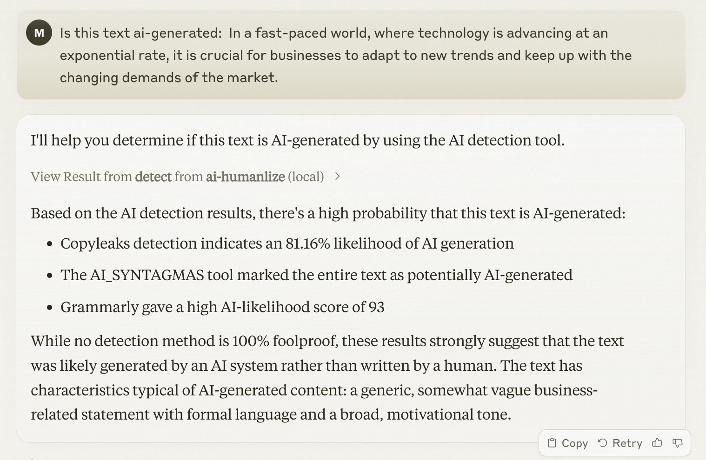

# AI Humanizer MCP Server
---
A powerful Model Context Protocol (MCP) server that helps refine AI-generated content to sound more natural and human-like. Built with advanced AI detection and text enhancement capabilities.

Powered by [text2go](https://text2go.ai).

---
# Table of Contents
1. [Features](#features)
2. [Prerequisites](#prerequisites)
3. [Installation](#installation)
4. [Usage](#usage)

---
## Screenshot



## ✨ Key Features

- 🤖 **AI Detection** - Accurately identify AI-generated content
- 👤 **Natural Language Enhancement** - Transform robotic text into natural human-like writing
- ⭐ **Grammar Perfection** - Ensure flawless grammatical accuracy
- 📋 **Readability Optimization** - Improve text flow and comprehension
- 📏 **Length Control** - Adjust content length while preserving meaning
- ⚖️ **Term Preservation** - Maintain specific terminology and key phrases


## Prerequisites
- node version >= 16
- Claude Desktop latest version

## Installation
1. Clone this repository
2. Install Dependencies
```bash
npm install
```
3. Build the project
```bash
npm run build
```

4. Configure Claude Desktop:
   - Open Claude Desktop
   - Navigate to Settings → Developer → Edit Config
   - Add the following configuration:
```json
{
    "ai-humanize": {
        "command": "node",
        "args": ["<YOUR_PROJECT_PATH>/build/index.js"]
    }
}
```
5. Restart Claude Desktop to apply changes


## 💡 Usage

### AI Text Detection

To check if text is AI-generated, simply ask Claude:

```text
Is this text ai-generated:  In a fast-paced world, where technology is advancing at an exponential rate, it is crucial for businesses to adapt to new trends and keep up with the changing demands of the market.
```
